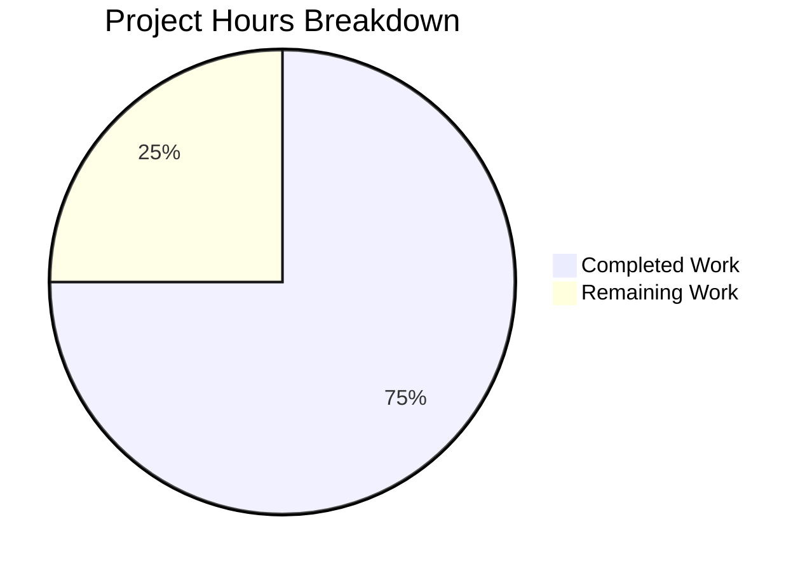

# Project Guide — Express.js Tutorial Server

## 1. Executive Summary

This project implements a minimal Express.js tutorial server from a completely empty repository (originally containing only a placeholder `README.md`). The server exposes two HTTP endpoints — `GET /` returning `"Hello world"` and `GET /evening` returning `"Good evening"` — built on Express.js 5.2.1 with Node.js v20.20.0.

**Completion: 6 hours completed out of 8 total hours = 75% complete.**

All six in-scope files have been created or modified, all four validation gates passed (dependencies, syntax, tests, runtime), and all three endpoint tests pass at a 100% rate. Zero compilation errors, zero test failures, zero runtime errors, and zero security vulnerabilities were found. The remaining 2 hours consist of human review, deployment configuration, and production smoke testing tasks that require manual intervention.

### Key Achievements
- Full project scaffolded from empty repository with proper Node.js conventions
- Express.js 5.2.1 integrated as the HTTP framework with two working routes
- Comprehensive test suite (3/3 passing) using Node.js built-in test runner — no extra test dependencies
- Clean app/server separation pattern enabling testability without port conflicts
- Complete documentation with endpoint table, examples, and setup instructions
- Zero security vulnerabilities across all 66 audited packages

### Critical Issues
- **None.** All validation gates passed with zero issues.

---

## 2. Validation Results Summary

### 2.1 Final Validator Accomplishments

The Final Validator agent verified all in-scope files and ran four validation gates. No fixes were required — all gates passed on the first complete validation cycle. One incremental fix was applied during development: the `package.json` test script was updated from a placeholder to `node --test test/server.test.js` to use the Node.js built-in test runner.

### 2.2 Gate Results

| Gate | Description | Result | Details |
|------|-------------|--------|---------|
| **Gate 1: Dependencies** | `npm install` and `npm audit` | ✅ PASSED | 66 packages audited, 0 vulnerabilities |
| **Gate 2: Syntax/Compilation** | `node --check` on all .js files | ✅ PASSED | index.js ✓, test/server.test.js ✓ |
| **Gate 3: Tests** | `npm test` (node --test) | ✅ PASSED | 3/3 tests pass, 0 failures, 0 skipped |
| **Gate 4: Runtime** | Server start + endpoint verification | ✅ PASSED | GET / → 200 "Hello world", GET /evening → 200 "Good evening", GET /nonexistent → 404 |

### 2.3 Test Results Detail

```
# tests 3
# suites 1
# pass 3
# fail 0
# cancelled 0
# skipped 0
# duration_ms 156.75
```

| Test | Assertion | Result |
|------|-----------|--------|
| GET / responds with HTTP 200 and body "Hello world" | Status 200, body === "Hello world" | ✅ PASS |
| GET /evening responds with HTTP 200 and body "Good evening" | Status 200, body === "Good evening" | ✅ PASS |
| GET /nonexistent responds with HTTP 404 | Status 404 | ✅ PASS |

### 2.4 Files Validated

| # | File | Action | Lines | Status |
|---|------|--------|-------|--------|
| 1 | `index.js` | CREATED | 78 | ✅ Express server with 2 routes, conditional listen, app export |
| 2 | `package.json` | CREATED | 30 | ✅ Express ^5.2.1 dep, start/test scripts, commonjs type |
| 3 | `.gitignore` | CREATED | 8 | ✅ node_modules, debug logs, .env exclusions |
| 4 | `test/server.test.js` | CREATED | 109 | ✅ 3 endpoint tests using node:test built-in runner |
| 5 | `README.md` | UPDATED | 52 | ✅ Full documentation with endpoints, setup, usage examples |
| 6 | `package-lock.json` | AUTO-GENERATED | 827 | ✅ Lock file present and committed |

### 2.5 Git Activity

- **Branch:** `blitzy-3be1053c-18ce-415c-96f8-59a1d84ae1e7`
- **Total commits:** 8 (1 initial + 7 agent commits)
- **Files changed:** 6
- **Lines added:** 1,104
- **Lines removed:** 1
- **Working tree:** Clean — no uncommitted changes

---

## 3. Hours Breakdown and Completion

### 3.1 Completed Hours (6 hours)

| Component | Hours | Details |
|-----------|-------|---------|
| Project initialization & dependency setup | 0.5 | package.json creation, npm install, Express.js 5.2.1 configuration |
| Express.js server implementation (index.js) | 1.5 | Route handlers, conditional listen pattern, app export, inline documentation |
| Test suite creation (test/server.test.js) | 2.0 | HTTP helper function, server lifecycle (before/after), 3 test cases, node:test integration |
| Documentation (README.md) | 1.0 | Comprehensive rewrite with endpoint table, curl examples, prerequisites, installation steps |
| Configuration (.gitignore, package.json scripts) | 0.5 | Gitignore patterns, start/test npm scripts, CommonJS type setting |
| Validation & debugging | 0.5 | Syntax checks, test execution, runtime verification, test script fix |
| **Total Completed** | **6.0** | |

### 3.2 Remaining Hours (2 hours)

| Component | Hours | Details |
|-----------|-------|---------|
| Code review and PR approval | 0.5 | Human review of all source files, test adequacy, documentation quality |
| Production deployment configuration | 1.0 | Choose hosting platform, configure PORT, set up deployment pipeline |
| Production smoke testing | 0.5 | Verify both endpoints respond correctly in deployed environment |
| **Total Remaining** | **2.0** | |

### 3.3 Completion Calculation

```
Completed Hours:  6
Remaining Hours:  2
Total Hours:      8
Completion:       6 / 8 = 75%
```

### 3.4 Visual Representation



---

## 4. Development Guide

### 4.1 System Prerequisites

| Requirement | Minimum Version | Verified Version |
|-------------|-----------------|------------------|
| Node.js | v18.0.0+ | v20.20.0 |
| npm | v8.0.0+ | v11.1.0 |
| Operating System | Linux, macOS, or Windows | Any |

### 4.2 Environment Setup

**Step 1: Clone the repository**

```bash
git clone <repository-url>
cd <repository-directory>
```

**Step 2: Switch to the feature branch**

```bash
git checkout blitzy-3be1053c-18ce-415c-96f8-59a1d84ae1e7
```

### 4.3 Dependency Installation

```bash
npm install
```

**Expected output:**
```
added 65 packages, and audited 66 packages in 2s
22 packages are looking for funding
  run `npm fund` for details
found 0 vulnerabilities
```

**Verification — confirm Express.js is installed:**
```bash
npm ls --depth=0
```

**Expected output:**
```
express-tutorial-server@1.0.0
└── express@5.2.1
```

### 4.4 Running Tests

```bash
npm test
```

**Expected output:**
```
TAP version 13
# Subtest: Express Tutorial Server — Endpoint Tests
    ok 1 - GET / responds with HTTP 200 and body "Hello world"
    ok 2 - GET /evening responds with HTTP 200 and body "Good evening"
    ok 3 - GET /nonexistent responds with HTTP 404
    1..3
ok 1 - Express Tutorial Server — Endpoint Tests
1..1
# tests 3
# pass 3
# fail 0
```

### 4.5 Starting the Server

**Default port (3000):**
```bash
npm start
```

**Custom port:**
```bash
PORT=8080 npm start
```

**Expected output:**
```
Server is running on port 3000
```

### 4.6 Verification Steps

With the server running, open a second terminal:

**Test endpoint 1 — Hello world:**
```bash
curl http://localhost:3000/
```
Expected: `Hello world`

**Test endpoint 2 — Good evening:**
```bash
curl http://localhost:3000/evening
```
Expected: `Good evening`

**Test unknown route — 404:**
```bash
curl -s -o /dev/null -w "%{http_code}" http://localhost:3000/nonexistent
```
Expected: `404`

### 4.7 Project Structure

```
├── index.js              # Express.js server with GET / and GET /evening routes
├── package.json          # Project manifest with Express.js 5.2.1 dependency
├── package-lock.json     # Dependency lock file
├── .gitignore            # Excludes node_modules/, .env, debug logs
├── README.md             # Project documentation
└── test/
    └── server.test.js    # 3 endpoint tests using Node.js built-in test runner
```

### 4.8 Troubleshooting

| Issue | Cause | Resolution |
|-------|-------|------------|
| `Error: Cannot find module 'express'` | Dependencies not installed | Run `npm install` |
| `Error: listen EADDRINUSE` | Port 3000 already in use | Use `PORT=<other-port> npm start` or kill the existing process |
| `npm test` fails with module error | Wrong Node.js version | Ensure Node.js v18+ is installed (`node --version`) |

---

## 5. Remaining Human Tasks

| # | Task | Priority | Severity | Hours | Action Steps |
|---|------|----------|----------|-------|-------------|
| 1 | Review all source code and approve PR | High | Medium | 0.5 | Review index.js route handlers, test coverage in server.test.js, package.json configuration, README accuracy. Verify response strings match requirements. Approve and merge PR. |
| 2 | Configure production deployment environment | Medium | Medium | 1.0 | Select hosting platform (e.g., Heroku, Railway, AWS). Configure PORT environment variable. Set up deployment method (Git push, container, or CI/CD). Deploy application. |
| 3 | Run production smoke tests | Low | Low | 0.5 | After deployment, verify GET / returns "Hello world" (HTTP 200) and GET /evening returns "Good evening" (HTTP 200) in the production environment. |
| | **Total Remaining Hours** | | | **2.0** | |

---

## 6. Risk Assessment

### 6.1 Technical Risks

| Risk | Severity | Likelihood | Mitigation |
|------|----------|------------|------------|
| Express.js 5.x semver-minor breaking change | Low | Low | Dependency is pinned with `^5.2.1`; lock file ensures reproducible installs. Monitor Express.js release notes. |
| Node.js version incompatibility on deployment target | Low | Low | Ensure deployment environment runs Node.js v18+. Add `.nvmrc` or `engines` field if needed. |

### 6.2 Security Risks

| Risk | Severity | Likelihood | Mitigation |
|------|----------|------------|------------|
| No rate limiting on endpoints | Low | Low | Tutorial scope — add `express-rate-limit` middleware if exposed to public traffic. |
| No HTTPS enforcement | Low | Medium | Configure TLS at the hosting/reverse-proxy level (e.g., nginx, cloud load balancer). |

### 6.3 Operational Risks

| Risk | Severity | Likelihood | Mitigation |
|------|----------|------------|------------|
| No process manager for restarts | Low | Medium | Use PM2, systemd, or container orchestration for production uptime. |
| No structured logging | Low | Low | Tutorial scope — add `morgan` or `pino` if production logging is required. |

### 6.4 Integration Risks

| Risk | Severity | Likelihood | Mitigation |
|------|----------|------------|------------|
| No CI/CD pipeline | Low | N/A | Out of scope per project requirements. Add GitHub Actions or similar if continuous deployment is desired. |

**Overall Risk Level: LOW** — This is a self-contained tutorial server with no external dependencies, no database, no authentication, and no sensitive data. All identified risks are low severity and relate to optional production-hardening measures beyond the tutorial scope.

---

## 7. Feature Requirement Traceability

| Requirement (from Agent Action Plan) | Status | Evidence |
|---------------------------------------|--------|----------|
| Express.js as HTTP framework | ✅ Complete | `require('express')` in index.js, express@5.2.1 in package.json |
| GET / returns "Hello world" | ✅ Complete | Route handler in index.js:39-41, test passes, runtime verified |
| GET /evening returns "Good evening" | ✅ Complete | Route handler in index.js:47-49, test passes, runtime verified |
| Configurable port (default 3000) | ✅ Complete | `process.env.PORT \|\| 3000` in index.js:56 |
| App exported for testability | ✅ Complete | `module.exports = app` in index.js:78, consumed by test/server.test.js:25 |
| CommonJS module system | ✅ Complete | `"type": "commonjs"` in package.json, require/module.exports throughout |
| npm start script | ✅ Complete | `"start": "node index.js"` in package.json:7 |
| Test suite for both endpoints | ✅ Complete | 3 tests in test/server.test.js — all passing |
| .gitignore with Node.js patterns | ✅ Complete | node_modules/, npm-debug.log*, .env in .gitignore |
| README with endpoint documentation | ✅ Complete | Endpoint table, curl examples, setup instructions in README.md |
