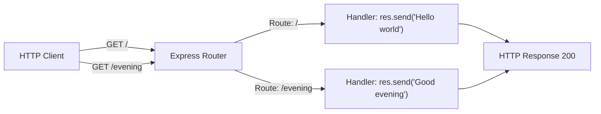

# Technical Specification

# 0. Agent Action Plan

## 0.1 Intent Clarification

### 0.1.1 Core Feature Objective

Based on the prompt, the Blitzy platform understands that the new feature requirement is to extend an existing tutorial-style Node.js server application by integrating the Express.js web framework and adding a new HTTP endpoint. Specifically:

- **Existing Product Baseline:** The current conceptual product is a minimal Node.js HTTP server that hosts a single endpoint returning the plain-text response `"Hello world"`. This server is implemented using the native Node.js `http` module without any external framework. The repository at its current state is empty (containing only a `README.md`), so this baseline must be established as part of the implementation.
- **Feature Addition — Express.js Integration:** The Express.js framework must be introduced into the project as the primary HTTP server framework, replacing the native `http` module approach. This involves adding Express.js as a project dependency and refactoring the server initialization to use the Express application pattern.
- **Feature Addition — New "Good Evening" Endpoint:** A second HTTP endpoint must be created that returns the plain-text response `"Good evening"`. This endpoint will coexist alongside the original `"Hello world"` endpoint, demonstrating Express.js multi-route capability.
- **Implicit Requirement — Project Scaffolding:** Since the repository is currently empty, the project must be initialized with a proper `package.json`, entry point file, and all necessary Node.js project scaffolding before the Express.js feature can be integrated.
- **Implicit Requirement — Tutorial Simplicity:** The user describes this as a "tutorial," which implies the implementation should remain clean, minimal, and well-documented — suitable for educational purposes without unnecessary complexity.

### 0.1.2 Special Instructions and Constraints

- **Framework Directive:** The user explicitly requests Express.js — no alternative frameworks (Fastify, Koa, Hapi, etc.) should be considered.
- **Response Fidelity:** The exact response strings must be preserved:
  - User Example: Endpoint 1 returns `"Hello world"`
  - User Example: Endpoint 2 returns `"Good evening"`
- **Architectural Constraint:** This is a single-file tutorial-style application. There is no need for middleware layers, database connections, authentication, or microservices architecture.
- **No Existing Dependencies:** The repository contains no `package.json`, no `node_modules`, and no existing JavaScript files. All project structure must be created from scratch.
- **Node.js Compatibility:** The runtime environment provides Node.js v20.20.0, which fully satisfies Express.js 5.x minimum requirement of Node.js 18+.

### 0.1.3 Technical Interpretation

These feature requirements translate to the following technical implementation strategy:

- To **establish the project foundation**, we will create a `package.json` manifest via `npm init` and install Express.js 5.2.1 as the sole runtime dependency.
- To **implement the baseline "Hello world" endpoint**, we will create an `index.js` entry point that initializes an Express application and registers a `GET /` route handler returning the string `"Hello world"`.
- To **implement the new "Good evening" endpoint**, we will register an additional `GET /evening` route handler in the same `index.js` file that returns the string `"Good evening"`.
- To **ensure runnability**, we will configure an npm `start` script that launches the server via `node index.js` and have the server listen on a configurable port (defaulting to port 3000).
- To **support testing and verification**, we will create a basic test file that validates both endpoints return the correct responses with appropriate HTTP status codes.

## 0.2 Repository Scope Discovery

### 0.2.1 Comprehensive File Analysis

The repository located at the root path contains only a single file:

| File Path | Status | Content |
|-----------|--------|---------|
| `README.md` | UNCHANGED (existing) | Contains only the heading `# 10feb_123` |

No other files or directories exist in the repository — no JavaScript source files, no `package.json`, no configuration files, no test files, and no `node_modules` directory. This confirms the repository is an empty scaffold requiring full project initialization.

**Search patterns evaluated across the repository:**

| Pattern | Files Found | Assessment |
|---------|-------------|------------|
| `**/*.js` | 0 | No JavaScript source files exist |
| `**/*.json` | 0 | No package manifests or config files |
| `**/*.yaml`, `**/*.yml` | 0 | No configuration files |
| `**/*.md` | 1 (`README.md`) | Single documentation file |
| `**/*.config.*` | 0 | No build/tool configuration |
| `**/test*`, `**/*spec*` | 0 | No test files |
| `Dockerfile*`, `docker-compose*` | 0 | No containerization files |
| `.github/workflows/*` | 0 | No CI/CD pipelines |
| `.nvmrc`, `.node-version` | 0 | No Node.js version pinning files |

**Integration point discovery:**

Since this is a greenfield implementation within an empty repository, there are no existing integration points to discover. All API endpoints, server configuration, and module structures will be created fresh.

### 0.2.2 Web Search Research Conducted

The following research was conducted to inform the implementation approach:

- **Express.js Current Stable Version:** Confirmed that Express.js 5.2.1 is the latest version published on npm. Express 5.x is now the default `latest` tag on npm as of the v5.1.0 release in March 2025.
- **Node.js Compatibility:** Express.js 5.x requires Node.js 18 or higher. The available runtime (Node.js v20.20.0) satisfies this requirement with full compatibility.
- **Express 5 API Pattern:** The current Express 5 quick-start pattern uses ES module-style imports (`import express from 'express'`) or CommonJS `require('express')`. For tutorial simplicity and broadest compatibility, the CommonJS pattern will be used.
- **Security Considerations:** Express 5 includes security improvements such as updated `path-to-regexp@8.x` for ReDoS mitigation and automatic promise rejection forwarding to error middleware.

### 0.2.3 New File Requirements

**New source files to create:**

| File | Purpose |
|------|---------|
| `index.js` | Main server entry point — initializes Express app, defines route handlers for `GET /` ("Hello world") and `GET /evening` ("Good evening"), starts the HTTP listener |
| `package.json` | Node.js project manifest — defines project metadata, Express.js dependency, and npm scripts |

**New test files to create:**

| File | Purpose |
|------|---------|
| `test/server.test.js` | Endpoint verification tests — validates that `GET /` returns "Hello world" and `GET /evening` returns "Good evening" with correct HTTP 200 status codes |

**Files to modify:**

| File | Modification |
|------|-------------|
| `README.md` | Update from placeholder heading to meaningful project documentation describing the server, its endpoints, and how to run it |

**New configuration (auto-generated):**

| File | Purpose |
|------|---------|
| `package-lock.json` | Auto-generated dependency lock file created by npm during `npm install` |
| `node_modules/` | Auto-generated dependency directory (excluded from version control via `.gitignore`) |

## 0.3 Dependency Inventory

### 0.3.1 Private and Public Packages

All packages required for this feature addition are public npm registry packages. No private packages are needed.

| Registry | Package Name | Version | Purpose |
|----------|-------------|---------|---------|
| npm (public) | `express` | `5.2.1` | Core HTTP web framework — provides routing, request/response handling, and middleware architecture for the Node.js server |

**Version Verification:**

- Express.js `5.2.1` was verified as a valid, published version on the npm registry (published approximately 2 months ago as of the current date).
- Express.js `5.2.1` is compatible with the project runtime Node.js v20.20.0 (minimum requirement: Node.js 18+).
- No additional runtime dependencies are needed beyond Express.js itself, which transitively brings in 65 sub-packages (e.g., `body-parser`, `cookie`, `debug`, `path-to-regexp`, etc.).

**Runtime Environment:**

| Component | Version | Source |
|-----------|---------|--------|
| Node.js | v20.20.0 | Pre-installed in environment |
| npm | 11.1.0 | Bundled with Node.js |

### 0.3.2 Dependency Updates

Since this is a greenfield project with no pre-existing dependencies, there are no dependency migrations or import transformation rules to apply. The dependency setup is purely additive.

**Import Patterns to Establish:**

The project will use CommonJS module syntax consistent with the default `"type": "commonjs"` in `package.json`:

```javascript
const express = require('express');
```

**External Reference Updates:**

| File | Update Required |
|------|----------------|
| `package.json` | Add `express` to `dependencies` block with version `^5.2.1` — **COMPLETED during environment setup** |
| `README.md` | Document the Express.js dependency and installation instructions |

**No CI/CD or build file updates are required** since the repository contains no pipeline configurations, Dockerfiles, or build tool manifests.

## 0.4 Integration Analysis

### 0.4.1 Existing Code Touchpoints

Since the repository is empty (containing only `README.md`), the integration analysis focuses on how the newly created files will interconnect and how the Express.js framework integrates with the Node.js runtime.

**Direct modifications required:**

| File | Integration Action |
|------|-------------------|
| `README.md` | Replace the placeholder heading `# 10feb_123` with comprehensive project documentation including endpoint descriptions, setup instructions, and usage examples |

**New integration points to establish:**

| Component | Integration Detail |
|-----------|--------------------|
| `index.js` ↔ Express.js | The main entry point imports and initializes an Express application instance, registers route handlers, and starts the HTTP listener |
| `index.js` ↔ Node.js `http` | Express.js internally uses Node.js native `http.createServer()` — no direct usage of the `http` module is needed in application code |
| `package.json` ↔ `index.js` | The `"main"` field points to `index.js`; the `"start"` script invokes `node index.js` |
| `test/server.test.js` ↔ `index.js` | The test file imports the Express app instance (exported from `index.js`) to perform HTTP assertions against both endpoints |

**Request flow through the system:**



**Server lifecycle integration:**

The Express application binds to a TCP port (default `3000`) using its `listen()` method. The server module exports the app instance separately from the `listen()` call to enable test-time HTTP assertions without port conflicts. This is a standard Express.js separation pattern:

```javascript
// Export app for testing
module.exports = app;
```

**No database, schema, or migration updates are required** for this feature addition. The application is stateless and returns hardcoded string responses.

## 0.5 Technical Implementation

### 0.5.1 File-by-File Execution Plan

Every file listed below MUST be created or modified to complete this feature addition.

**Group 1 — Core Feature Files:**

| Action | File | Purpose |
|--------|------|---------|
| CREATE | `index.js` | Main application entry point — initializes the Express app, registers the `GET /` route returning `"Hello world"`, registers the `GET /evening` route returning `"Good evening"`, exports the app instance, and starts the HTTP listener on port 3000 |
| MODIFY | `package.json` | Add `"start"` script (`node index.js`), verify `"main"` points to `index.js`, confirm Express.js 5.2.1 dependency is listed |

**Group 2 — Supporting Infrastructure:**

| Action | File | Purpose |
|--------|------|---------|
| CREATE | `.gitignore` | Exclude `node_modules/` and other generated artifacts from version control |

**Group 3 — Tests and Documentation:**

| Action | File | Purpose |
|--------|------|---------|
| CREATE | `test/server.test.js` | Endpoint verification — tests that `GET /` returns status 200 with body `"Hello world"` and `GET /evening` returns status 200 with body `"Good evening"` |
| MODIFY | `README.md` | Replace placeholder with project description, endpoint documentation, setup instructions, and run commands |

### 0.5.2 Implementation Approach per File

**`index.js` — Core Server (CREATE)**

This file is the heart of the application. It establishes the Express.js server with two route handlers:

- Import Express.js using `require('express')`
- Create an application instance via `express()`
- Define `GET /` route handler that calls `res.send('Hello world')`
- Define `GET /evening` route handler that calls `res.send('Good evening')`
- Configure the server to listen on `process.env.PORT || 3000`
- Export the `app` instance for test accessibility

```javascript
const express = require('express');
const app = express();
```

**`package.json` — Project Manifest (MODIFY)**

Update the auto-generated manifest to include a meaningful `start` script and verify the Express.js dependency entry:

- Set `"scripts.start"` to `"node index.js"`
- Confirm `"dependencies.express"` reads `"^5.2.1"`
- Set `"description"` to a meaningful project summary

**`.gitignore` — Version Control Exclusions (CREATE)**

Standard Node.js gitignore patterns to exclude generated files:

- `node_modules/`
- `npm-debug.log*`
- `.env`

**`test/server.test.js` — Endpoint Tests (CREATE)**

Uses Node.js built-in `http` module (or a lightweight test approach) to validate both endpoints:

- Test 1: `GET /` responds with HTTP 200 and body `"Hello world"`
- Test 2: `GET /evening` responds with HTTP 200 and body `"Good evening"`
- Test 3: Unknown route returns HTTP 404

**`README.md` — Project Documentation (MODIFY)**

Replace the current single-line content with structured documentation covering:

- Project title and description
- Prerequisites (Node.js v18+)
- Installation instructions (`npm install`)
- How to start the server (`npm start`)
- Available endpoints table (`GET /` and `GET /evening`)
- Expected responses for each endpoint

## 0.6 Scope Boundaries

### 0.6.1 Exhaustively In Scope

**All feature source files:**

| Pattern / Path | Description |
|----------------|-------------|
| `index.js` | Express.js server with both route handlers |
| `package.json` | Project manifest with Express.js dependency and npm scripts |
| `package-lock.json` | Auto-generated dependency lock file |

**All test files:**

| Pattern / Path | Description |
|----------------|-------------|
| `test/**/*.js` | All test files under the `test/` directory |
| `test/server.test.js` | Primary endpoint verification test suite |

**Configuration files:**

| Pattern / Path | Description |
|----------------|-------------|
| `.gitignore` | Version control exclusion rules for `node_modules/` and generated files |

**Documentation:**

| Pattern / Path | Description |
|----------------|-------------|
| `README.md` | Updated project documentation with endpoint descriptions and usage instructions |

**Complete in-scope file inventory:**

| # | File | Action | Priority |
|---|------|--------|----------|
| 1 | `index.js` | CREATE | Critical — core feature implementation |
| 2 | `package.json` | MODIFY | Critical — dependency and script configuration |
| 3 | `.gitignore` | CREATE | High — standard project hygiene |
| 4 | `test/server.test.js` | CREATE | High — endpoint validation |
| 5 | `README.md` | MODIFY | Medium — documentation update |
| 6 | `package-lock.json` | AUTO-GENERATED | Auto — created by npm |

### 0.6.2 Explicitly Out of Scope

The following items are explicitly excluded from this feature addition:

- **TypeScript configuration** — The user describes a plain JavaScript tutorial; no TypeScript compilation or type definitions are needed
- **Docker/containerization** — No Dockerfile, docker-compose, or container orchestration files
- **CI/CD pipelines** — No GitHub Actions, GitLab CI, or other pipeline configurations
- **Environment variable management** — No `.env` files or `dotenv` package beyond the basic `PORT` variable fallback
- **Middleware layers** — No authentication, CORS, logging, or body-parsing middleware beyond Express.js defaults
- **Database integration** — No database connections, ORM setup, or data persistence
- **Frontend/UI components** — This is a pure API server with no HTML templates, static file serving, or client-side code
- **Performance optimization** — No clustering, load balancing, caching, or compression middleware
- **Linting/formatting tools** — No ESLint, Prettier, or other code quality tooling
- **Monitoring/observability** — No health check endpoints, metrics collection, or logging frameworks
- **Refactoring of any existing code unrelated to the feature** — The only existing file (`README.md`) is modified solely to document the new feature

## 0.7 Rules for Feature Addition

The following rules govern the implementation of this feature addition:

- **Response String Fidelity:** The endpoint responses must exactly match the user-specified strings — `"Hello world"` (with lowercase "w") and `"Good evening"` (with lowercase "e"). No additional formatting, JSON wrapping, or HTML markup should be applied to these responses.
- **Framework Mandate:** Express.js is the explicitly requested framework. The implementation must use Express.js for HTTP routing and request handling — not the native Node.js `http` module directly, nor any alternative framework.
- **Tutorial Simplicity Convention:** As a tutorial project, the codebase must remain minimal and readable. Each file should be concise, well-commented where helpful, and free of over-engineering. Avoid patterns that add complexity without serving the educational purpose (e.g., dependency injection containers, abstract factory patterns, or layered architecture).
- **Single Entry Point Pattern:** The application should have a single entry point (`index.js`) that contains all route definitions. There is no need for separate route files, controller modules, or service layers given the scope of two simple endpoints.
- **Port Configuration:** The server must listen on `process.env.PORT` if available, falling back to port `3000` as default. This is standard Express.js convention and supports deployment flexibility.
- **Testability:** The Express `app` instance must be exported separately from the `listen()` call so that tests can import the app and make HTTP assertions without binding to a port. This follows the widely accepted Express.js testing pattern.
- **CommonJS Module System:** The project uses `"type": "commonjs"` in `package.json` (the Node.js default). All imports must use `require()` / `module.exports` syntax for consistency.
- **No user-specified special rules were provided** beyond the feature requirements themselves. The implementation should follow standard Node.js and Express.js community conventions.

## 0.8 References

### 0.8.1 Repository Files and Folders Searched

The following files and folders were searched across the codebase to derive conclusions for this Agent Action Plan:

| Path | Type | Tool Used | Findings |
|------|------|-----------|----------|
| `` (root) | Folder | `get_source_folder_contents` | Repository contains only `README.md` — confirmed empty scaffold |
| `README.md` | File | `read_file` | Contains single line: `# 10feb_123` — placeholder heading with no project content |
| `/tmp/blitzy/10feb_123/main/` | Directory | `bash (find, ls)` | Verified as the actual repository location with `.git` directory and `README.md` |
| `/tmp/environments_files/` | Directory | `bash (find)` | Does not exist — no user-provided environment files |
| Global filesystem | Directories | `bash (find -name ".blitzyignore")` | No `.blitzyignore` files found anywhere in the filesystem |

### 0.8.2 Technical Specification Sections Consulted

The following sections were retrieved from the existing Technical Specification to assess project context:

| Section | Content Summary | Relevance to Task |
|---------|----------------|-------------------|
| 1.1 Executive Summary | Describes "AI Umbrella" — a Java 21/Spring Boot enterprise application | **Not relevant** — contradicts the Node.js tutorial described by the user |
| 1.2 System Overview | Details a commercial insurance platform with microservices architecture | **Not relevant** — unrelated to the Node.js server feature request |
| 3.1 Programming Languages | Documents Java 21 LTS as the primary backend language | **Not relevant** — this project uses Node.js/JavaScript |
| 3.2 Frameworks & Libraries | Documents Spring Boot ecosystem as core framework | **Not relevant** — this project uses Express.js |

**Assessment:** The pre-existing Technical Specification describes an entirely different system (enterprise Java application) and does not apply to the current Node.js tutorial project. All implementation decisions were derived from the user's explicit instructions and web research on Express.js.

### 0.8.3 External Research Conducted

| Research Topic | Source | Key Finding |
|----------------|--------|-------------|
| Express.js latest stable version | npmjs.com/package/express | Express.js `5.2.1` is the latest published version |
| Express.js npm default version | expressjs.com blog | Express 5.1.0 became the default `latest` tag on npm in March 2025 |
| Express.js Node.js compatibility | npm docs, GitHub releases | Express 5.x requires Node.js 18 or higher |
| Express 5 breaking changes | GitHub expressjs/express releases | Express 5 dropped support for Node.js versions before v18 and removed deprecated v3/v4 API methods |

### 0.8.4 Attachments and Figma URLs

- **Attachments provided:** None
- **Figma screens provided:** None
- **Environment variables provided:** None
- **Secrets provided:** None
- **User-provided setup instructions:** None

